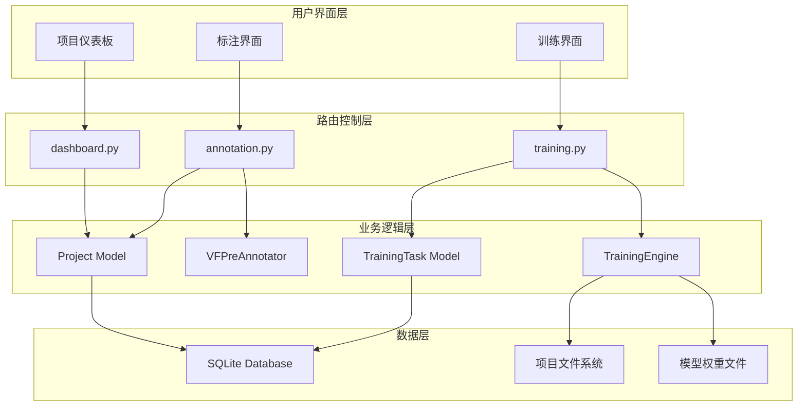
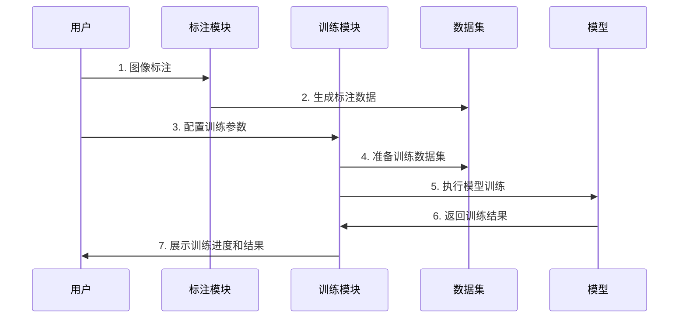
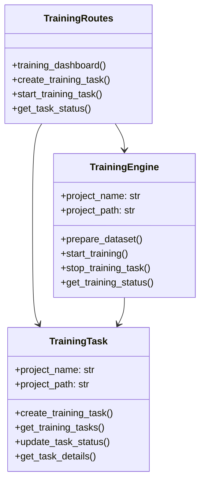
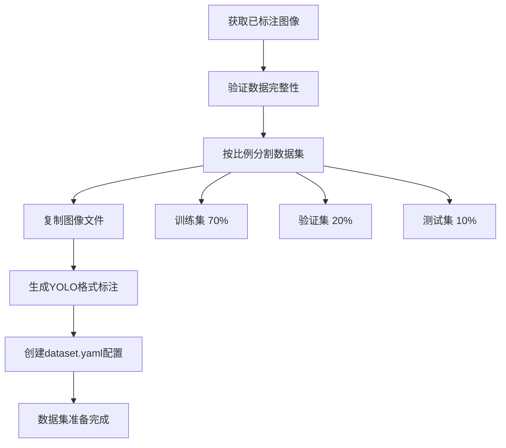
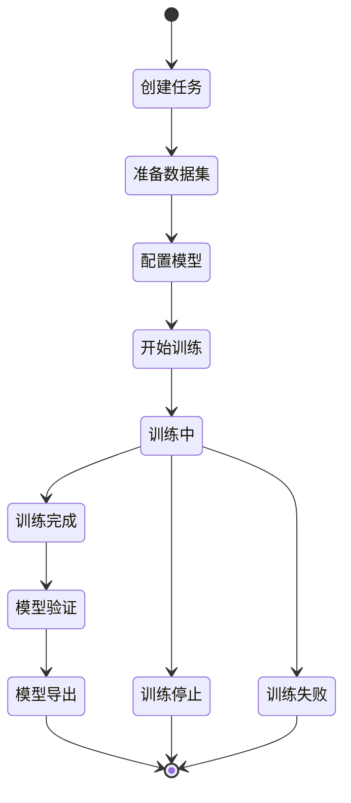

# VisioFirm 项目标注和训练模块设计文档

## 1. 项目概述

### 1.1 背景
VisioFirm 是一个基于 Flask 的 AI 驱动图像标注平台，已具备基础的图像标注功能。本设计旨在为每个项目新增完整的标注和训练两大功能模块，其中标注功能维持现有实现不变，训练功能需要完善和增强。

### 1.2 设计目标
- **标注模块**：维持现有功能架构，确保与训练模块无缝集成
- **训练模块**：基于已有基础完善功能，支持平台内数据集配置、本地计算资源调用、ultralytics 框架模型训练
- **完整流程**：实现从标注到训练的端到端工作流

### 1.3 技术约束
- 后端框架：Flask + SQLite
- 前端技术：原生 JavaScript + HTML + CSS
- AI 框架：仅支持 ultralytics 框架
- 部署方式：本地计算资源

## 2. 总体架构

### 2.1 模块关系图



### 2.2 数据流架构



## 3. 标注模块设计

### 3.1 功能保持
标注模块维持现有功能架构，主要包括：

#### 3.1.1 核心功能
- **手动标注**：支持边界框、有向边界框、多边形分割
- **AI 预标注**：集成 YOLOv10、SAM2、Grounding DINO
- **标注编辑**：实时编辑、撤销重做、快捷键操作
- **数据导出**：支持 YOLO、COCO、Pascal VOC、CSV 格式

#### 3.1.2 数据模型
```sql
-- 保持现有数据库表结构
Images (image_id, project_id, filename, absolute_path, width, height)
Annotations (annotation_id, image_id, user_id, type, class_name, x, y, width, height, rotation, segmentation)
Classes (class_id, project_id, class_name, color)
ReviewedImages (image_id, user_id, reviewed_at)
```

### 3.2 与训练模块集成点
- **数据验证**：确保标注数据质量满足训练要求
- **格式转换**：自动转换为 ultralytics 支持的数据格式
- **统计信息**：提供标注数量、类别分布等训练前分析

## 4. 训练模块设计

### 4.1 架构组件

#### 4.1.1 核心组件关系



### 4.2 数据集配置功能

#### 4.2.1 数据集准备流程



#### 4.2.2 数据集目录结构
```
project_name/
├── dataset/
│   ├── train/
│   │   ├── images/
│   │   └── labels/
│   ├── val/
│   │   ├── images/
│   │   └── labels/
│   ├── test/
│   │   ├── images/
│   │   └── labels/
│   └── dataset.yaml
```

#### 4.2.3 数据集配置参数
| 参数名 | 类型 | 默认值 | 说明 |
|--------|------|--------|------|
| train_ratio | float | 0.7 | 训练集比例 |
| val_ratio | float | 0.2 | 验证集比例 |
| test_ratio | float | 0.1 | 测试集比例 |
| min_annotations | int | 1 | 最小标注数量要求 |

### 4.3 训练配置管理

#### 4.3.1 支持的模型类型
| 模型名称 | 描述 | 适用场景 |
|----------|------|----------|
| yolov8n | YOLOv8 Nano | 快速推理，精度较低 |
| yolov8s | YOLOv8 Small | 平衡速度和精度 |
| yolov8m | YOLOv8 Medium | 较高精度 |
| yolov8l | YOLOv8 Large | 高精度 |
| yolov8x | YOLOv8 Extra Large | 最高精度 |
| yolov10n | YOLOv10 Nano | 最新版本，最快 |
| yolov10s | YOLOv10 Small | 最新版本，平衡 |
| yolov10m | YOLOv10 Medium | 最新版本，较高精度 |
| yolov10l | YOLOv10 Large | 最新版本，高精度 |
| yolov10x | YOLOv10 Extra Large | 最新版本，最高精度 |

#### 4.3.2 训练参数配置
```yaml
训练参数:
  基础参数:
    - epochs: 训练轮数 (默认: 100)
    - batch_size: 批量大小 (默认: 16)
    - learning_rate: 学习率 (默认: 0.01)
    - image_size: 图像尺寸 (默认: 640)
    
  设备选择:
    - auto: 自动选择最佳设备
    - cuda:0, cuda:1: 指定GPU设备
    - cpu: CPU设备
    
  优化器选择:
    - auto: 自动选择
    - SGD: 随机梯度下降
    - Adam: Adam优化器
    - AdamW: AdamW优化器
```

### 4.4 训练执行引擎

#### 4.4.1 训练生命周期



#### 4.4.2 训练监控机制
- **实时进度跟踪**：epoch 进度、损失值变化
- **资源监控**：GPU/CPU 使用率、内存占用
- **早停机制**：防止过拟合，节省计算资源
- **检查点保存**：定期保存模型，支持断点续训

### 4.5 进度监控系统

#### 4.5.1 监控数据结构
```sql
-- 训练任务表
training_tasks (
    id INTEGER PRIMARY KEY,
    task_name TEXT NOT NULL,
    model_type TEXT NOT NULL,
    status TEXT DEFAULT 'pending',
    progress INTEGER DEFAULT 0,
    created_at TIMESTAMP,
    started_at TIMESTAMP,
    completed_at TIMESTAMP,
    error_message TEXT,
    model_path TEXT,
    metrics TEXT
)

-- 训练日志表
training_logs (
    id INTEGER PRIMARY KEY,
    task_id INTEGER,
    epoch INTEGER,
    loss REAL,
    accuracy REAL,
    val_loss REAL,
    val_accuracy REAL,
    timestamp TIMESTAMP
)
```

#### 4.5.2 状态管理
| 状态 | 描述 | 可执行操作 |
|------|------|-----------|
| pending | 任务已创建，等待执行 | 启动、删除 |
| running | 训练进行中 | 停止、查看进度 |
| completed | 训练完成 | 查看结果、导出模型、验证 |
| stopped | 用户主动停止 | 重新启动、删除 |
| failed | 训练失败 | 查看错误、重新启动、删除 |

### 4.6 结果输出与模型管理

#### 4.6.1 训练结果组成
```
training_runs/task_{task_id}/
├── weights/
│   ├── best.pt          # 最佳模型权重
│   ├── last.pt          # 最后一轮权重
│   └── epoch_*.pt       # 阶段性权重
├── results/
│   ├── training_curves.png    # 训练曲线图
│   ├── confusion_matrix.png   # 混淆矩阵
│   ├── PR_curve.png          # PR曲线
│   └── F1_curve.png          # F1曲线
├── validation/
│   ├── val_batch0.jpg        # 验证结果示例
│   └── predictions.txt       # 预测结果
└── args.yaml                 # 训练参数记录
```

#### 4.6.2 性能指标
- **mAP50**：IoU=0.5时的平均精度
- **mAP50-95**：IoU从0.5到0.95的平均精度
- **Precision**：精确率
- **Recall**：召回率
- **F1-Score**：F1分数

#### 4.6.3 模型导出功能
```python
支持格式:
  - PyTorch (.pt): 原生格式
  - ONNX (.onnx): 跨平台推理
  - TensorRT (.engine): NVIDIA GPU加速
  - TensorFlow Lite (.tflite): 移动端部署
  - CoreML (.mlmodel): iOS/macOS部署
```

## 5. 用户界面设计

### 5.1 训练仪表板界面

#### 5.1.1 页面布局
```
┌─────────────────────────────────────────────────────┐
│ 项目标题 | 已标注: 150张 | 类别: 5个  [新建训练任务] │
├─────────────────────────────────────────────────────┤
│ ┌─────────────────────┐ ┌─────────────────────────┐ │
│ │     训练任务列表     │ │      训练配置管理        │ │
│ │                    │ │                        │ │
│ │ [任务1] [运行中] 75% │ │ [配置1] YOLOv8s       │ │
│ │ [任务2] [已完成]     │ │ [配置2] YOLOv10m      │ │
│ │ [任务3] [失败]       │ │ [新建配置]              │ │
│ └─────────────────────┘ └─────────────────────────┘ │
├─────────────────────────────────────────────────────┤
│ ┌─────────────────────┐ ┌─────────────────────────┐ │
│ │     训练进度监控     │ │      模型性能分析        │ │
│ │                    │ │                        │ │
│ │ Loss: ████████▒▒   │ │ mAP50: 0.856          │ │
│ │ Epoch: 75/100      │ │ Precision: 0.891      │ │
│ │ ETA: 25min         │ │ Recall: 0.823         │ │
│ └─────────────────────┘ └─────────────────────────┘ │
└─────────────────────────────────────────────────────┘
```

#### 5.1.2 交互功能
- **任务管理**：创建、启动、停止、删除训练任务
- **实时监控**：训练进度条、损失曲线、性能指标
- **配置管理**：保存、加载、复用训练配置
- **结果展示**：训练曲线、混淆矩阵、验证图片

### 5.2 JavaScript 模块架构

#### 5.2.1 前端模块结构
```javascript
// training.js 主要模块
class TrainingDashboard {
    constructor() {
        this.taskManager = new TaskManager();
        this.progressMonitor = new ProgressMonitor();
        this.configManager = new ConfigManager();
        this.resultViewer = new ResultViewer();
    }
}

class TaskManager {
    // 任务创建、管理、控制
    createTask(config) {}
    startTask(taskId) {}
    stopTask(taskId) {}
    deleteTask(taskId) {}
}

class ProgressMonitor {
    // 实时进度监控
    updateProgress(taskId) {}
    displayMetrics(metrics) {}
    renderCharts(data) {}
}
```

## 6. API 接口设计

### 6.1 训练管理接口

#### 6.1.1 核心 API 列表

| 接口路径 | 方法 | 功能 | 参数 |
|----------|------|------|------|
| `/training/<project_name>` | GET | 训练仪表板页面 | project_name |
| `/training/create_task` | POST | 创建训练任务 | task_name, model_type, config |
| `/training/start_task` | POST | 启动训练任务 | project_name, task_id |
| `/training/stop_task` | POST | 停止训练任务 | project_name, task_id |
| `/training/task_status/<project_name>/<task_id>` | GET | 获取任务状态 | project_name, task_id |
| `/training/download_model/<project_name>/<task_id>` | GET | 下载模型 | project_name, task_id |

#### 6.1.2 API 响应格式
```json
{
    "success": true,
    "data": {
        "task_id": 123,
        "status": "running",
        "progress": 75,
        "metrics": {
            "loss": 0.245,
            "mAP50": 0.856,
            "epoch": 75
        }
    },
    "message": "操作成功"
}
```

### 6.2 错误处理机制

#### 6.2.1 错误类型和处理
| 错误类型 | HTTP状态码 | 处理方式 |
|----------|------------|----------|
| 参数缺失 | 400 | 返回具体缺失参数 |
| 项目不存在 | 404 | 提示项目路径错误 |
| 训练资源冲突 | 409 | 提示资源占用情况 |
| 系统内部错误 | 500 | 记录详细日志 |

## 7. 数据持久化设计

### 7.1 数据库扩展

#### 7.1.1 新增训练相关表
```sql
-- 训练配置表
CREATE TABLE training_configs (
    id INTEGER PRIMARY KEY AUTOINCREMENT,
    config_name TEXT NOT NULL,
    model_type TEXT NOT NULL,
    epochs INTEGER DEFAULT 100,
    batch_size INTEGER DEFAULT 16,
    learning_rate REAL DEFAULT 0.001,
    image_size INTEGER DEFAULT 640,
    device TEXT DEFAULT 'auto',
    optimizer TEXT DEFAULT 'auto',
    augmentation TEXT DEFAULT '{}',
    other_params TEXT DEFAULT '{}',
    created_at TIMESTAMP DEFAULT CURRENT_TIMESTAMP
);
```

### 7.2 文件系统管理

#### 7.2.1 项目目录结构增强
```
projects/
└── project_name/
    ├── config.db              # 项目数据库
    ├── images/                 # 原始图像
    ├── annotations/            # 标注文件
    ├── dataset/               # 训练数据集
    │   ├── train/
    │   ├── val/
    │   ├── test/
    │   └── dataset.yaml
    ├── training_runs/         # 训练结果
    │   └── task_123/
    │       ├── weights/
    │       ├── results/
    │       └── logs/
    └── exports/               # 导出的模型
        ├── best_model.onnx
        └── model_package.zip
```

## 8. 系统集成测试

### 8.1 测试场景

#### 8.1.1 功能测试用例

| 测试用例 | 测试步骤 | 预期结果 |
|----------|----------|----------|
| 创建训练任务 | 1. 完成图像标注<br>2. 配置训练参数<br>3. 创建训练任务 | 任务创建成功，状态为pending |
| 执行训练流程 | 1. 启动训练任务<br>2. 监控训练进度<br>3. 等待训练完成 | 训练正常完成，生成模型文件 |
| 模型验证导出 | 1. 验证训练模型<br>2. 导出不同格式<br>3. 下载模型包 | 验证指标正确，导出成功 |

#### 8.1.2 性能测试指标
- **响应时间**：API 响应 < 2s，页面加载 < 3s
- **并发处理**：支持 5 个并发训练任务
- **资源占用**：内存使用 < 8GB，GPU 利用率 > 80%

### 8.2 兼容性测试

#### 8.2.1 环境兼容性
- **操作系统**：Linux, macOS, Windows
- **Python 版本**：3.10+
- **硬件要求**：8GB+ RAM, NVIDIA GPU (可选)
- **浏览器支持**：Chrome 90+, Firefox 88+, Safari 14+